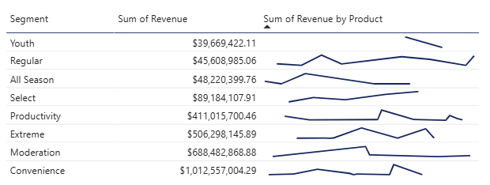
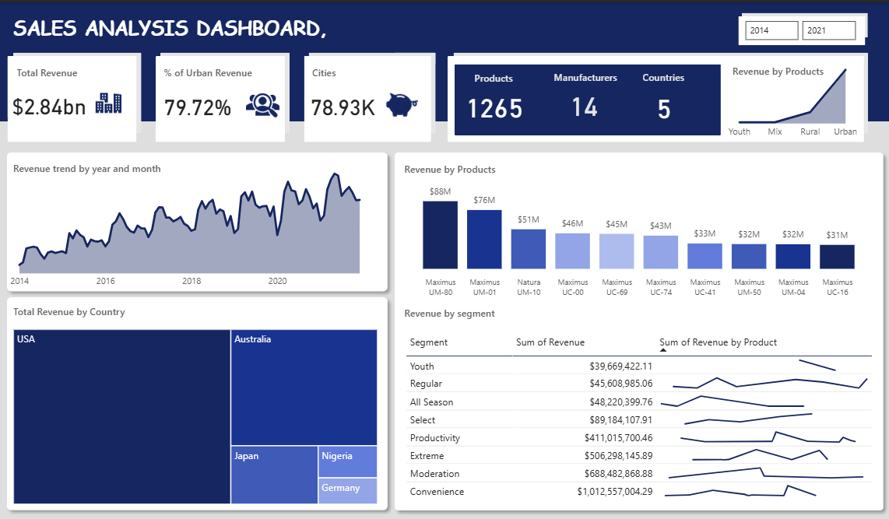

# 📊 Sales Analysis Dashboard  
### Multi-Country Sales Performance (2014–2021)

This project provides an end-to-end analysis of global sales data across multiple markets, manufacturers, and product categories. The dashboard highlights revenue trends, customer geography, product performance, and segment behavior over a 7-year period.

---

## 📌 Project Summary

The goal of this project is to deliver:

- Clear visibility into regional and product-level sales performance  
- Identification of revenue drivers and market opportunities  
- A unified and cleaned dataset ready for BI reporting  
- Professional data modeling for fast, optimized Power BI dashboards  

This analysis supports:

- Business growth strategy  
- Product investment decisions  
- Geographic expansion planning  
- Performance tracking of manufacturers and product lines  

---

## 📁 Dataset Overview

| Field Category     | Description |
|--------------------|-------------|
| **Sales Data** | Revenue, product ID, date, manufacturer, city & country |
| **Geo Data** | City → Country → Region mapping |
| **Manufacturer Data** | Manufacturer names, IDs |
| **Table_01** | Product category, segment, and price fields |

**Time Period:** 2014–2021  
**Rows (Combined):** ~79K cities, 1265 products  
**Countries:** 5  

---

## 🛠️ Tools Used

| Tool | Purpose |
|------|---------|
| **Power BI** | KPI visuals, trend charts, interactive dashboards |
| **Power Query** | Merging files, transforming, splitting, cleaning |
| **DAX** | Calculations & KPI measures |
| **Excel (optional)** | Initial data review |

---

# 🧹 Data Cleaning & Transformation  

## 1️⃣ **Sales Data (Main Fact Table)**

- Appended multiple country files into one unified table  
- Standardized country naming:  
  - `"United state"` → `"USA"`  
- Removed empty rows  
- Validated data types (Date, Revenue, Category, Manufacturer ID)  
- Ensured consistent formats for revenue, product, and time fields  

**Outcome:**  
A clean and reliable **Sales Fact Table** ready for modeling.

---

## 2️⃣ **Manufacturer Table**

- Removed empty rows  
- **Transposed table** to convert vertical list into horizontal structure  
- Removed empty rows again after transpose  
- Removed unnecessary columns (logos, duplicate listings)  
- Promoted first row to headers  

---

## 3️⃣ **Geo Table**

- Removed empty rows  
- Removed first row containing non-data labels  
- Promoted first row to headers  
- Split (delimited) the `City` column  
- Deleted the redundant `City.2` field  
- Renamed `City.1` to proper city name  
- Removed empty rows in the Country column  
- Deleted countries not used in the Sales dataset  

---

## 4️⃣ **Table_01 (Product Category & Segment Table)**

- Filled down the **Category** field  
- Split (delimited) the *Product* column → created **Segment**  
- Delimited the *Price* column → removed USD prefix  
- Corrected data types: Category, Product, Segment, Price  

---

## 5️⃣ **Data Modeling**

Created relationships between:

- **Sales → Geo**  
- **Sales → Manufacturer**  
- **Sales → Table_01 (Product Category/Segment)**  

The final model follows a **Star Schema**, ensuring optimal reporting and query performance.
## 🗂️ Data Model (Relationship View)

Below is the data model used in this project, showing how the Sales, Geo, Manufacturer, and Product tables are connected in a star schema design.


---

# 📈 Key Insights

### 🌍 Geographic
- Urban regions contribute **79.72%** of total revenue  
- USA is the largest market, followed by Australia and Japan  
- Nigeria and Germany show **emerging growth potential**

### 📦 Product Performance
- Top products:  
  - **Maximus UM-80 – 88M**  
  - **Maximus UM-01 – 76M**  
  - **Natura UM-10 – 51M**  
- Product revenue strongly tied to Maximus line

### 🧩 Segment
- Revenue by Segment:  
  - **Convenience — 1.01bn**  
  - **Moderation — 688M**  
  - **Extreme — 506M**  
- Convenience + Moderation ≈ **60% of total revenue**
## 🧩 Segment Analysis

Below is the segment performance visualization from the dashboard.




### 📆 Trend
- Consistent revenue growth 2014–2021  
- Seasonal dips but strong recovery patterns  
- Highest performance seen after 2018  

---

# 📊 KPI Measures (DAX)

```DAX
Total Revenue = SUM(Sales[Revenue])

Urban Revenue =
CALCULATE(
    [Total Revenue],
    Geo[Area] = "Urban"
)

Urban Revenue % =
DIVIDE([Urban Revenue], [Total Revenue])

Distinct Products = DISTINCTCOUNT(Products[ProductID])

Distinct Manufacturers = DISTINCTCOUNT(Manufacturer[ManufacturerID])

Distinct Countries = DISTINCTCOUNT(Geo[Country])
```
## 📊 Sales Analysis Dashboard

Below is the full Power BI dashboard used in this project.  
It provides an overview of revenue trends, top products, segment performance, geographic insights, and manufacturer analysis.



